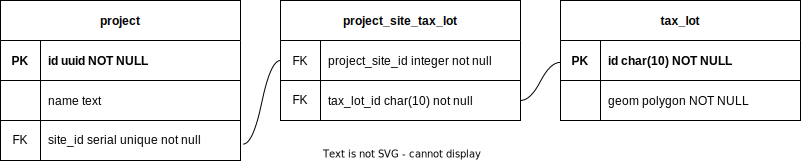
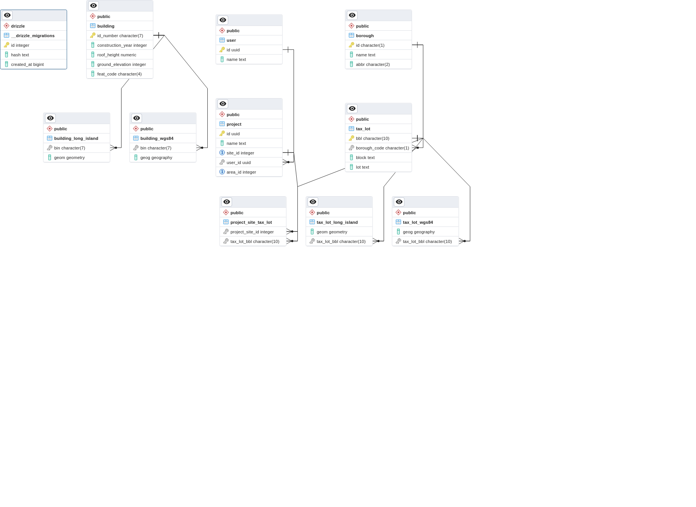

## API Database ERD aspirational

## Database ERD as implemented

## notes
Triggers to calculate areas when something is added/subtracted
Tax lot schema update details:
    Just use surrogate key
    Land uses derive from building 

The facilities database claims to know the bbl to which a bin belongs. However, there are ~120,000 bbls that are in the facilities database that are not listed in mappluto. It will likely be more reliable to use a spatial join instead. These spatial joins should be performant enough when using ny state plane; long island. As such, the building_tax_lot relationship table is dropped
