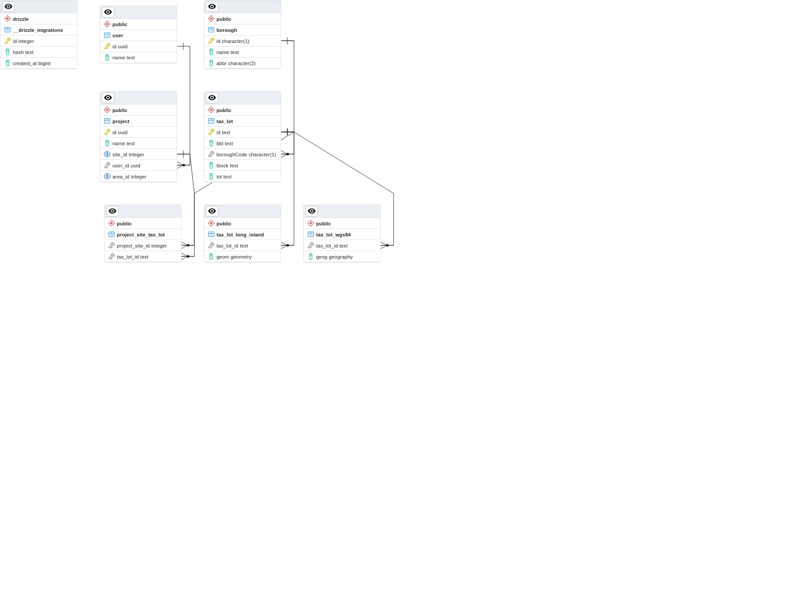

## API Database ERD aspirational

## Database ERD as implemented

## notes
Triggers to calculate areas when something is added/subtracted
Tax lot schema update details:
    Just use surrogate key
    Land uses derive from building 
